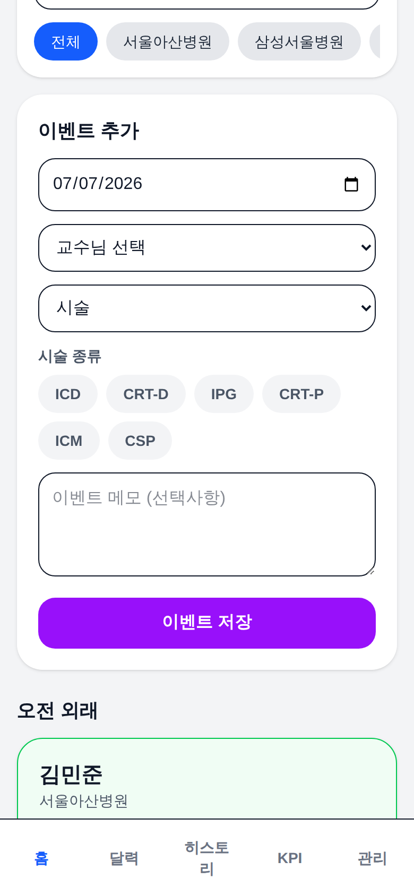
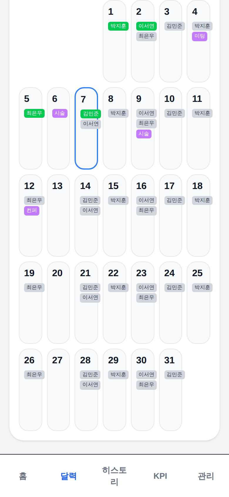
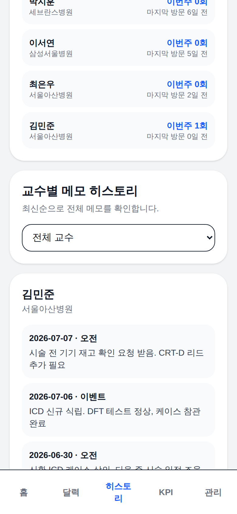
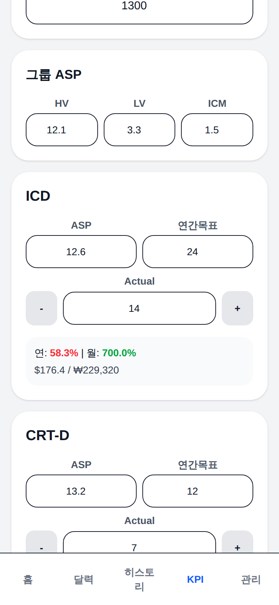

# 외래 방문 트래커 (Clinic Tracker)

의료기기(심장 부정맥 디바이스) 영업사원을 위한 **모바일 퍼스트 필드 CRM 앱**입니다.
병원별 교수님 외래 일정 관리, 방문 체크와 메모 히스토리, 시술/컨퍼런스 이벤트,
제품별 영업 KPI(달성률·매출 갭 계산)를 한 화면 흐름으로 처리합니다.

실무(Abbott CRM 영업) 도메인을 그대로 모델링해서 만든 실사용 앱입니다 —
HV(ICD·CRT-D) / LV(IPG·CRT-P) / ICM 제품 그룹, ASP 기반 매출 환산,
시술 종류 태깅(ICD/CRT-D/IPG/CRT-P/ICM/CSP) 등 현장 용어와 계산 방식을 따릅니다.

## 화면

| 홈 — 오늘의 외래·이벤트 | 달력 | 히스토리 | KPI |
|---|---|---|---|
|  |  |  |  |

> 직접 보려면: 실행 후 **관리 탭 → "데모 데이터 채우기"** 버튼으로 샘플
> 교수님/일정/방문메모/이벤트/KPI가 채워집니다.

## 주요 기능

- **오늘의 외래**: 요일·오전/오후 기준으로 오늘 방문할 교수님 목록 자동 표시, 방문체크 + 방문 메모(히스토리 누적)
- **이벤트**: 시술/컨퍼런스/미팅/기타를 교수님+날짜에 연결, 시술은 제품 태그(ICD, CRT-D, CSP...) 지정
- **달력**: 월간 뷰에서 외래·이벤트·방문완료를 한눈에
- **KPI**: 제품별 ASP × 연간목표 × 실적 → 달성률(%), 원화 환산 매출 갭, "갭을 메우려면 몇 대 필요한지" 계산
- **PWA**: 홈 화면 설치 지원 (모바일 필드 사용 전제)
- **백업/복원**: 전체 데이터 JSON 내보내기/가져오기

## 기술 스택

Next.js 16 (App Router, Turbopack) · React 19 · TypeScript 5 · Tailwind CSS v4 · PWA

## 기술적 의사결정

- **백엔드 없는 100% 클라이언트 앱**: 개인 필드 도구라는 요구사항에 맞춰
  `localStorage` 영속화를 선택. 방어적 파싱(`safeParse*`)과
  `hasLoadedStoredData` 게이트로 "로드 전 빈 상태가 저장 데이터를 덮어쓰는"
  클래식 버그를 차단.
- **Hydration-safe 날짜 처리**: 날짜 기반 UI는 서버 렌더 시점과 클라이언트
  시점이 다를 수밖에 없어, `today`를 `null`로 시작해 마운트 후
  `requestAnimationFrame`에서 채우는 패턴으로 hydration mismatch를 원천 차단.
- **타임존 버그 예방**: 날짜 키는 `toISOString()` 대신 로컬 기준
  `formatDateKey`(YYYY-MM-DD)로 통일 — UTC 변환으로 하루가 밀리는 버그 방지.
- **이벤트 = 방문의 확장**: 이벤트 참석 체크는 별도 기계를 만들지 않고
  sentinel `period` 값("이벤트")으로 기존 방문/메모 시스템을 재사용.

## 실행

```bash
npm install
npm run dev     # http://localhost:3000
npm run build   # 프로덕션 빌드
npm run lint
```

## 로드맵

- 시술 이벤트에 디바이스/리드 **키트 체크리스트** 연동 (시술 전 재고 확인)
- 케이스 로깅(모델·시리얼) → KPI 실적 자동 집계
- 병원별 KPI 브레이크다운
